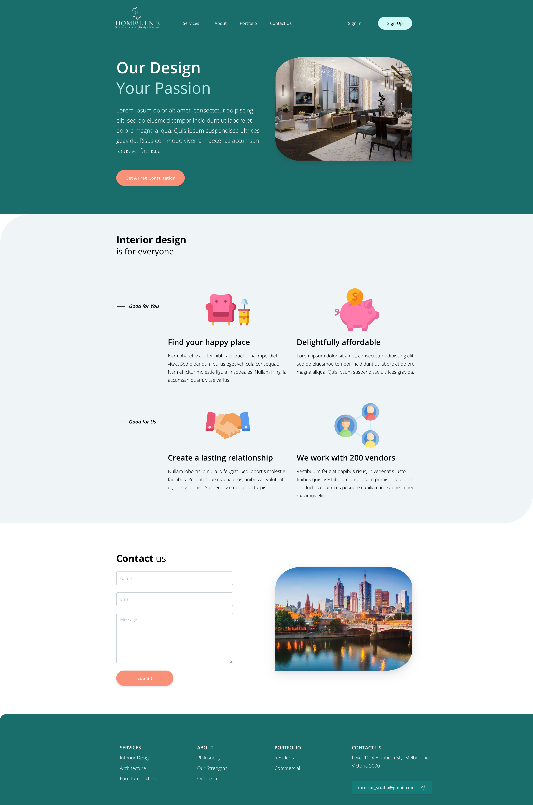

<h1>Mock up design</a></h1>

<h2 id="documentation">Tools and Resources</h2>

<ul>
  <li>IDE: <a href="https://code.visualstudio.com/download">Visual Studio Code 1.66.1</a></li>
  <li>Node Version: 12.22.1</li>
  <li>NPM Version: 8.1.0</li>
  <li>Vue Themes Template: <a href="https://www.creative-tim.com/product/vue-argon-design-system?affiliate_id=116187">Vue Argon Design System</a></li>
  <li>Framework: VueJS</li>
  <li>Front End: Vue Router, Bootstrap 4, Bootstrap Vue, Stripe Elements, Scss Styling</i>
</ul>

<h2 id="quick-start">Quick start</h2>

<ul>
  <li>Clone the repo: <code class="highlighter-rouge">git clone https://github.com/lys1995/interview_mock-up-design.git</code>.</li>
  <li>Make sure you have <a href="https://nodejs.org/en/">Node.js</a> installed</li>
  <li>Navigate to the main directory (from terminal) where package.json is located.</li>
  <li>Run npm install</li>
  <li>Run npm run serve to start the local development server and start mock up page.</li>
</ul>

<h2 id="file-structure">File Structure</h2>

<pre class="highlight"><code>

|-- interview_mock-up-design-main
    |-- App.vue
    |-- main.js
    |-- router.js
    |-- assets
    |   |-- scss
    |   |   |-- argon.scss
    |   |   |-- bootstrap
    |   |   |-- custom
    |   |-- vendor
    |       |-- font-awesome
    |       |   |-- css
    |       |   |   |-- font-awesome.css
    |       |   |   |-- font-awesome.min.css
    |       |   |-- fonts
    |       |       |-- FontAwesome.otf
    |       |       |-- fontawesome-webfont.eot
    |       |       |-- fontawesome-webfont.svg
    |       |       |-- fontawesome-webfont.ttf
    |       |       |-- fontawesome-webfont.woff
    |       |       |-- fontawesome-webfont.woff2
    |       |-- nucleo
    |           |-- css
    |           |   |-- nucleo-svg.css
    |           |   |-- nucleo.css
    |           |-- fonts
    |               |-- nucleo-icons.eot
    |               |-- nucleo-icons.svg
    |               |-- nucleo-icons.ttf
    |               |-- nucleo-icons.woff
    |               |-- nucleo-icons.woff2
    |-- components
    |   |-- Badge.vue
    |   |-- BaseAlert.vue
    |   |-- BaseButton.vue
    |   |-- BaseCheckbox.vue
    |   |-- BaseDropdown.vue
    |   |-- BaseInput.vue
    |   |-- BaseNav.vue
    |   |-- BasePagination.vue
    |   |-- BaseProgress.vue
    |   |-- BaseRadio.vue
    |   |-- BaseSlider.vue
    |   |-- BaseSwitch.vue
    |   |-- Card.vue
    |   |-- CloseButton.vue
    |   |-- Icon.vue
    |   |-- NavbarToggleButton.vue
    |-- layout
    |   |-- AppFooter.vue
    |   |-- AppHeader.vue
    |-- plugins
    |   |-- argon-kit.js
    |   |-- globalComponents.js
    |   |-- globalDirectives.js
    |-- views
        |-- StartPage.vue
        |-- components
            |-- Inputs.vue

</code></pre>

<h2>Inspiration</h2>

<ul>
  <li>UI components is inspired by <a href="https://demos.creative-tim.com/vue-argon-design-system/documentation/#argon-design-system">Argon Docs</a>.</li>
  <li>VueJS Design System is inspired by <a href="https://www.creative-tim.com/product/vue-argon-design-system?affiliate_id=116187">Creative Tim<a>.</li>
</ul>

<h2 id="useful-links">Useful Links</h2>

<ul>
  <li><a href="https://v2.vuejs.org/v2/guide/">Vue.js</a> official guide</li>
  <li><a href="https://www.youtube.com/channel/UCVyTG4sCw-rOvB9oHkzZD1w">Argon documents</a></li>
  <li><a href="https://v2.vuejs.org/resources/themes.html">Vue Themes</a> from Creative Tim</li>
</ul>
